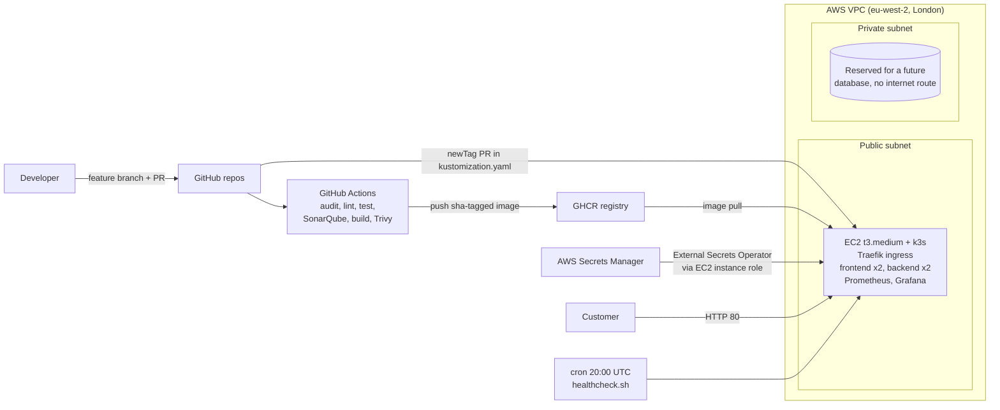

# Zuri Market Platform

A secure, automated and observable delivery platform for **Zuri Market**, a two-service e-commerce app (Express API + React storefront). It replaces manual SSH deployments with a Git-driven process: every change goes through a pull request, automated checks and a recorded rollout to Kubernetes on AWS.

**Live store:** http://35.178.115.47 &nbsp;·&nbsp; 2026 April DevOps Cohort capstone

| Repository | Purpose |
| --- | --- |
| [zuriapp-backend](https://github.com/oluonabiyi/zuriapp-backend) | Express API, Dockerfile, CI pipeline |
| [zuriapp-frontend](https://github.com/oluonabiyi/zuriapp-frontend) | React (Vite) storefront, Dockerfile, CI pipeline |
| [zuri-platform](https://github.com/oluonabiyi/zuri-platform) (this repo) | Terraform, Kubernetes manifests, monitoring, health check, docs |

---

## 1. The problem

Zuri Market ran on two hand-built EC2 boxes. The case study describes four connected problems:

| Problem | What it looked like |
| --- | --- |
| Inconsistent infrastructure | Staging and prod configured by hand, drifted apart (Node version, env vars, debug logging) |
| Manual, unsafe delivery | SSH in, `git pull`, restart pm2. No tests, no pipeline, no rollback. A bad deploy broke checkout for 6 hours |
| Weak security | SSH and database open to `0.0.0.0/0`, secrets in Git and Slack, no scanning, unknown SSH key holders |
| No observability | Customers reported outages before the team knew |

## 2. Architecture



### Key decisions

| Decision | Choice | Why |
| --- | --- | --- |
| Cluster | k3s on one EC2 `t3.medium`, provisioned by Terraform | Real, reproducible compute at about $1.35/day, and a real server for the cron job. EKS adds ~$73/month for the control plane alone |
| Server access | AWS Systems Manager Session Manager, **no SSH port, no key pair** | Fixes "nobody knows who holds SSH keys": access is an IAM permission and every session is logged |
| Network | Public subnet for the node (port 80 open, 6443 only from the admin IP); private subnet with no internet route reserved for data | The storefront must be public; data must never be. No NAT gateway saves ~$1/day |
| Registry | GitHub Container Registry | Pipelines log in with the built-in `GITHUB_TOKEN`, so no AWS keys live in GitHub |
| Secrets | AWS Secrets Manager → External Secrets Operator → Kubernetes Secret | The API key never touches Git, Slack, Terraform state or a `.env` file in the cluster |
| Image tags | `sha-<commit>` | Every running image traces back to one exact commit; `latest` is never deployed |
| Region | `eu-west-2` (London), pinned in Terraform | Close to Zuri's UK headquarters; never depends on a local CLI setting |

## 3. How a change reaches production

1. Developer pushes a feature branch and opens a PR (direct pushes to `main` are blocked).
2. **CI on the PR:** `npm ci --ignore-scripts` → `npm audit` (production deps) → ESLint → tests → (frontend: build) → Docker build → **Trivy** scan.
3. After review, merge to `main`. **CI on main** adds the **SonarQube quality gate** and pushes `ghcr.io/oluonabiyi/<app>:sha-xxxxxxx`.
4. A small PR in this repo updates `newTag` in `k8s/kustomization.yaml`. That PR *is* the deployment record.
5. `kubectl apply -k k8s/` triggers a **rolling update** (`maxUnavailable: 0`, so the site stays up).
6. Grafana shows request rate, errors and latency for the new version. `kubectl rollout undo` rolls back in one command.

**Proven end to end:** the storefront headline change went PR → CI → image `sha-52fadd3` → deploy PR → rolling update → live, with no SSH at any point.

## 4. Run it locally

Clone all three repos side by side:

```bash
mkdir zuri && cd zuri
git clone https://github.com/oluonabiyi/zuriapp-backend.git
git clone https://github.com/oluonabiyi/zuriapp-frontend.git
git clone https://github.com/oluonabiyi/zuri-platform.git
cp zuriapp-backend/.env.example zuriapp-backend/.env   # then set API_SECRET_KEY
cd zuri-platform
docker compose up --build
```

Open http://localhost:8080. The frontend's nginx proxies `/api` to the backend container.

## 5. Run it in the cloud

Prerequisites: AWS CLI (non-root IAM identity, region `eu-west-2`), Terraform ≥ 1.10, kubectl, Helm, the Session Manager plugin.

```bash
# 1. Remote state bucket (once)
cd terraform/bootstrap
terraform init && terraform apply -var state_bucket_name=zuri-tfstate-<name>

# 2. Dev environment: VPC, security groups, IAM, secret, EC2 + k3s + cron
cd ../environments/dev
# set admin_cidr in terraform.tfvars to <your-ip>/32
terraform init && terraform plan -out=dev.plan && terraform apply dev.plan

# 3. Real secret value (never in Git or Terraform)
aws secretsmanager put-secret-value --secret-id zuri/dev/backend \
  --secret-string "{\"API_SECRET_KEY\":\"$(openssl rand -hex 32)\"}"

# 4. kubeconfig via Session Manager (no SSH)
ID=$(terraform output -raw instance_id); IP=$(terraform output -raw public_ip)
CMD=$(aws ssm send-command --instance-ids $ID --document-name AWS-RunShellScript \
  --parameters 'commands=["cat /etc/rancher/k3s/k3s.yaml"]' --query Command.CommandId --output text)
sleep 5
aws ssm get-command-invocation --command-id $CMD --instance-id $ID \
  --query StandardOutputContent --output text | sed "s/127.0.0.1/$IP/" > ~/.kube/zuri-dev.yaml
export KUBECONFIG=~/.kube/zuri-dev.yaml

# 5. Cluster add-ons and the app
helm repo add external-secrets https://charts.external-secrets.io
helm install external-secrets external-secrets/external-secrets -n external-secrets --create-namespace --wait
kubectl apply -f k8s/external-secrets/cluster-secret-store.yaml
kubectl apply -k k8s/

# 6. Monitoring
helm repo add prometheus-community https://prometheus-community.github.io/helm-charts
helm install monitoring prometheus-community/kube-prometheus-stack \
  -n monitoring --create-namespace -f k8s/monitoring/values.yaml --wait
kubectl apply -f k8s/monitoring/servicemonitor.yaml -f k8s/monitoring/dashboard-configmap.yaml
```

**Prod** uses the same modules from `terraform/environments/prod` with its own state key and CIDRs.

## 6. Infrastructure as code

```
terraform/
├── bootstrap/            S3 state bucket (versioned, encrypted, public access blocked)
├── modules/
│   ├── network/          VPC, public + private subnets, routes, security groups
│   ├── iam/              EC2 role: SSM access + read exactly one secret
│   ├── secrets/          Secrets Manager secret (value set outside Terraform)
│   └── compute/          EC2 (IMDSv2, encrypted disk) + k3s + cron via user_data
└── environments/
    ├── dev/              10.10.0.0/16
    └── prod/             10.20.0.0/16
```

- **Remote state:** S3 backend with native locking (`use_lockfile = true`).
- **Two environments:** same modules, different variable files and state keys, so they cannot drift apart.
- **Dev apply:** 16 resources, including VPC, 2 subnets, 2 route tables, IGW, 2 security groups, IAM role + policy + profile, secret, EC2.

## 7. CI/CD

Each app repo has `.github/workflows/ci.yml` with two jobs:

| Job | Steps | Runs on |
| --- | --- | --- |
| `lint-test-sonar` | `npm ci --ignore-scripts`, `npm audit --omit=dev --audit-level=high`, ESLint, tests, (frontend build), SonarQube quality gate | Every push and PR; the Sonar gate on `main` |
| `build-scan-push` | Docker build, Trivy scan (fails on fixable HIGH/CRITICAL), push to GHCR | Every push and PR; push only on `main` |

- Third-party actions are **pinned to commit SHAs**. In March 2026, `trivy-action` tags were briefly replaced with malicious code; a pinned SHA cannot be moved.
- **Least privilege:** the workflow is read-only by default; only `build-scan-push` gets `packages: write`.
- Secrets are passed through `env:`, never expanded inside shell scripts.

### Evidence: the pipeline fails when it should

The first `main` run was **blocked by the SonarQube quality gate** (security rating C, gate requires A). The four findings, and what was done:

| SonarQube finding | Fix |
| --- | --- |
| Omitting `--ignore-scripts` in the pipeline (`npm ci`) | `npm ci --ignore-scripts`: no third-party install scripts run in CI |
| Omitting `--ignore-scripts` in the Dockerfile | Same flag in both Dockerfiles |
| Secrets expanded inside a `run` block | Token and username passed via `env:` and read as `$REGISTRY_TOKEN` |
| Write permission at workflow level | Moved `packages: write` to the one job that needs it |

After the fixes, the gate passed and images were pushed.

**SonarQube Cloud free plan:** it only returns gate results for `main`, so the gate runs on merges to `main`. On a paid plan or self-hosted SonarQube, PRs would be gated too.

### Other scan results

- **Trivy:** no fixable HIGH/CRITICAL findings. The backend image removes npm after install (the app runs with plain `node`), which removes npm's bundled packages, a common source of findings.
- **npm audit:** issues reported only in dev-only build tooling (ESLint, Vite, Vitest). `npm audit --omit=dev` reports **0** in production dependencies, and the frontend runtime image is nginx with static files only.

## 8. Kubernetes

| Resource | Details |
| --- | --- |
| Deployments | `backend` and `frontend`, 2 replicas each, rolling updates with `maxUnavailable: 0`, readiness and liveness probes, CPU/memory requests and limits |
| Pod security | Non-root (`runAsUser` 1000 / 101), `allowPrivilegeEscalation: false`, all capabilities dropped, backend read-only root filesystem |
| Services | `backend:5000`, `frontend:8080` |
| Ingress | Traefik: `/api` → backend, `/` → frontend. `/metrics` deliberately not exposed |
| ConfigMaps | Backend settings (`PORT`, `STORE_NAME`, `NODE_ENV`); frontend nginx config |
| Secrets | `ExternalSecret` syncs `API_SECRET_KEY` from AWS Secrets Manager hourly |
| RBAC | App service accounts have **no API token mounted**; `developer-readonly` role can view workloads and logs but **cannot read Secrets** |

```bash
kubectl auth can-i list pods  -n zuri --as=dev --as-group=zuri-developers     # yes
kubectl auth can-i get secrets -n zuri --as=dev --as-group=zuri-developers    # no
kubectl auth can-i list pods  -n zuri --as=system:serviceaccount:zuri:backend # no
```

**Secret flow:** Secrets Manager → External Secrets Operator (authenticates with the EC2 **instance role**, no access keys) → Kubernetes Secret `backend-secrets` → environment variable in the pod. IMDS hop limit 2 lets pods use the instance role.

## 9. Monitoring

- `kube-prometheus-stack` (Prometheus + Grafana); Alertmanager disabled to save memory.
- The backend exposes `/metrics` via `prom-client`: `http_requests_total` and `http_request_duration_seconds`, labelled by route pattern (not raw URL) to keep label counts small.
- A `ServiceMonitor` scrapes it every 30 s.
- Dashboard **"Zuri Market: Backend Health"** (`k8s/monitoring/zuri-dashboard.json`, auto-loaded from a ConfigMap): request rate by route, error rate (5xx and 4xx separately), latency p50/p95, pod restarts.
- Grafana is not exposed publicly; access is through `kubectl port-forward`.
- `k8s/monitoring/load-test.sh <ip>` generates realistic traffic, including deliberate 404s and 401s.

## 10. Daily health check

`scripts/healthcheck.sh` calls `/api/health` through the ingress, checks for HTTP 200 and `"status":"ok"`, and **appends** one timestamped line (status, HTTP code, response time) to `/var/log/zuri/health-report.log`. It exits non-zero when unhealthy.

Terraform's `user_data` installs the script and the schedule `/etc/cron.d/zuri-healthcheck`:

```
0 20 * * * root /opt/zuri/healthcheck.sh >> /var/log/zuri/cron.log 2>&1
```

Check it ran: `cat /var/log/zuri/health-report.log` and `grep CRON /var/log/syslog` via Session Manager. A copy of the report is kept in [`docs/health-report.log`](docs/health-report.log).

## 11. Security: before and after

| Case study problem | Now |
| --- | --- |
| SSH and database open to `0.0.0.0/0` | No port 22 at all; database SG accepts only the app tier; Kubernetes API only from the admin IP |
| Unknown SSH key holders | No SSH keys exist; access via Session Manager, controlled by IAM and logged |
| `.env` committed and pasted in Slack | Secret lives in Secrets Manager only; `.env` is git-ignored; `.env.example` holds placeholders |
| No dependency or image scanning | npm audit, SonarQube and Trivy run in CI and can fail the build |
| Anyone can push to `main` | Branch protection: PRs required, checks must pass |
| Broad permissions | EC2 role reads one secret; pods have no API token; CI jobs have minimal permissions |

## 12. Jenkins vs GitHub Actions for Zuri Market

| | GitHub Actions | Jenkins |
| --- | --- | --- |
| Hosting | GitHub-hosted runners | You run, patch and back up the Jenkins server and agents |
| Setup | One YAML file per repo, next to the code | Server install, plugins, credentials store, Jenkinsfile |
| Cost for Zuri | Free minutes for public repos, pay-per-minute for private | Server cost plus engineer time |
| Security upkeep | GitHub patches runners; you pin actions | Plugins are a frequent source of vulnerabilities and need regular updates |
| Flexibility | Large marketplace; limited control of hosted runners | Very flexible; any network or hardware |

**Recommendation:** GitHub Actions. Zuri's code already lives on GitHub, and a three-developer team with no dedicated DevOps engineer should not own a CI server. Jenkins would make sense later if builds had to run inside a private network or on custom hardware.

## 13. Evidence

Screenshots are in [`docs/evidence/`](docs/evidence/).

- [ ] Branch protection and merged PRs with review comments
- [ ] `terraform plan` / `apply` (dev), module tree, S3 state bucket
- [ ] `docker compose up` with the store on localhost:8080
- [ ] Green CI runs in both repos, plus the run blocked by the SonarQube gate
- [ ] SonarQube findings and the passing gate after fixes
- [ ] GHCR packages with `sha-` tags
- [ ] `kubectl get deploy,pods,svc,ingress -n zuri`, ExternalSecret `SecretSynced`, RBAC `can-i` output
- [ ] Security group rules (no port 22)
- [ ] Grafana dashboard with live data
- [ ] `healthcheck.sh`, the cron entry, and `docs/health-report.log` with one line per day
- [ ] End-to-end change: old vs new headline, rollout status and history

## 14. Cost and teardown

About **$1.35/day** for dev (t3.medium, public IPv4, 30 GB gp3, one secret). No NAT gateway, load balancer or EKS control plane.

```bash
# copy the health report first: it only exists on the server
cd terraform/environments/dev && terraform destroy
cd ../prod && terraform destroy          # if applied
# empty the versioned state bucket, then:
cd ../../bootstrap && terraform destroy
```

## 15. Limitations and next steps

- **Single node:** a single point of failure. Next: 2+ nodes across availability zones or a managed cluster.
- **HTTP only:** add a domain and cert-manager for TLS.
- **Deploy step is manual** (`kubectl apply`). Next: ArgoCD so the cluster pulls changes from Git, removing inbound admin access.
- **No alerting:** enable Alertmanager with rules on error rate and latency.
- **Free SonarQube plan:** gate runs on `main` only.
- `prom-client` is deprecated in favour of `@prometheus-io/client`; migrate when stable.

## Repository layout

```
zuri-platform/
├── docker-compose.yml        Full stack locally
├── scripts/healthcheck.sh    Daily health check (installed by Terraform)
├── terraform/                Bootstrap, modules, dev/prod environments
├── k8s/                      Kustomize app manifests, External Secrets store, monitoring
└── docs/                     Evidence screenshots, health report
```
